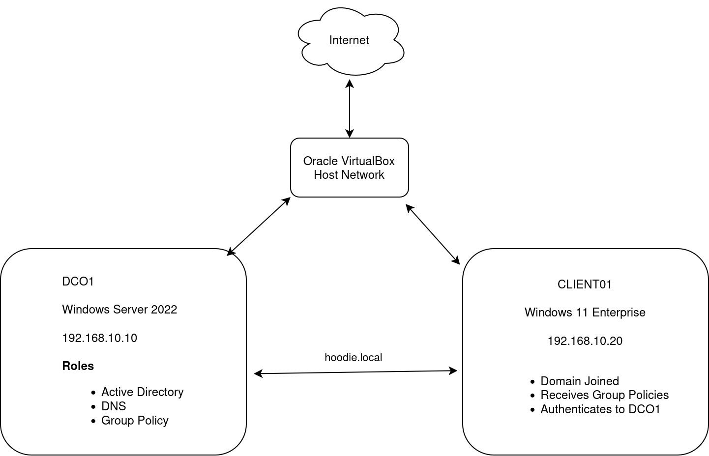

# Enterprise Group Policy Management Lab

[](https://www.microsoft.com/windows-server)


Enterprise Group Policy Management using Windows Server 2022 Active Directory.

## Table of Contents

- Overview
- Architecture
- Technologies Used
- Lab Objectives
- Environment
- Step-by-Step Deployment
- Group Policy Configuration
- Validation
- Troubleshooting
- Skills Demonstrated
- Future Improvements

## Environment

| Component | Configuration |
|-----------|---------------|
| Hypervisor | Oracle VirtualBox |
| Domain Controller | Windows Server 2022 |
| Client | Windows 11 Enterprise |
| DNS | Active Directory Integrated |
| Domain | company.local |
| Group Policy | Group Policy Management Console |

## Architecture



## Overview

This project demonstrates the deployment and administration of an enterprise Active Directory environment using Windows Server 2022. The lab focuses on centralized management through Organizational Units (OUs), Group Policy Objects (GPOs), DNS, and Windows 11 Enterprise clients.

## Technologies Used

- Windows Server 2022
- Active Directory Domain Services (AD DS)
- Group Policy Management
- DNS
- Windows 11 Enterprise
- Oracle VirtualBox

## Lab Objectives

- Deploy a Windows Server 2022 Domain Controller
- Configure Active Directory Domain Services
- Create Organizational Units (OUs)
- Create and manage Group Policy Objects (GPOs)
- Configure DNS for domain services
- Join Windows 11 clients to the domain
- Apply and validate Group Policy settings

## Skills Demonstrated

- Active Directory Administration
- Group Policy Management
- Windows Server Administration
- DNS Configuration
- Enterprise Network Design
- User and Computer Administration
- Security Policy Deployment
- Technical Documentation

## Repository Structure

```
docs/
images/
README.md
```

## Future Enhancements

- Roaming Profiles
- Folder Redirection
- Fine-Grained Password Policies
- Windows Server Update Services (WSUS)
- Group Policy Preferences
- PowerShell Automation
